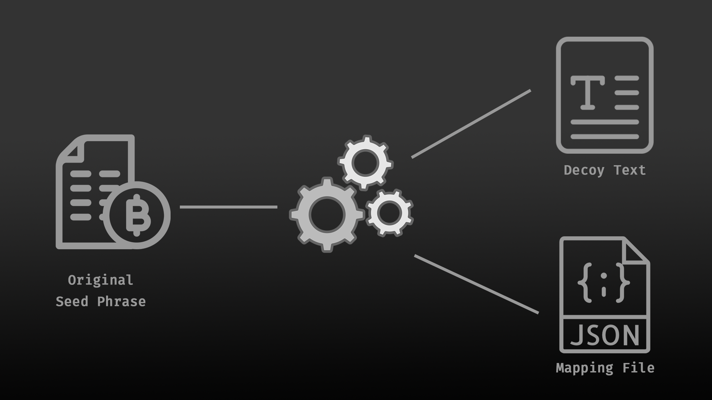

# How Decoy Phrase Works

Decoy Phrase operates through two core components: **Decoy Phrase Generator** and **Permanent Storage**. The generator transforms sensitive information into decoy text **locally and offline**, ensuring the original data is never exposed or transmitted. Permanent Storage then securely preserves only the **mapping structure and/or decoy output**, not the original sensitive data.

Together, these components enable users to protect seed phrases, digital keys, and other sensitive information while maintaining privacy, integrity, and recoverability.

## Core Idea: Two-Part Security Model

<figure><figcaption></figcaption></figure>

Decoy Phrase uses the Decoy Phrase Generator to split a secret into two separate parts:

#### **1. Decoy Text**

A transformed output that appears normal or random, but is **not** a seed phrase and **cannot** be used to access assets.

#### **2. Mapping File**

A technical file that serves as a **recovery guide**. It does **not** contain the seed phrase and remains meaningless without the correct corresponding Decoy Text.

The core security comes from this separation: **no single file acts as a complete key** to reconstruct the original secret.

## Main Components (System Modules)

#### **A. Decoy Phrase Generator**

The core component that runs entirely on the user’s device and is responsible for:

* **Transform:** seed phrase → Decoy Text + Mapping File
* **Recover:** Decoy Text + Mapping File → original seed phrase

No server ever receives the seed phrase. All sensitive processing is performed exclusively on the client side.

***

#### **B. Permanent Storage Layer**

The storage layer used to persist artifacts permanently on the permaweb.\
Its functions include:

* Storing the **Decoy Text** and **Mapping File** as two separate objects
* Enabling cross-device access, as long as the user retains the required credentials or keys

Only the transformed and separated artifacts (and, if applied, encrypted data) are stored in permanent storage — **never the original seed phrase**.

***

#### **C. Multi-Password** Management in Permanent Storage

An access management model that allows Decoy Text and Mapping File to:

* Be stored in different “areas” (separate vaults)
* Use different passwords for each storage area

## Data Flow&#x20;

The system-level data flow is as follows:



### Input (Offline)

The user enters a seed phrase or other sensitive text into the Generator.



### Transform (Offline)

The Generator produces two outputs: **Decoy Text** and **Mapping File**.



### Separate Storage (Online or Offline)

Decoy Text and Mapping Files can be uploaded or stored **anywhere**, as long as they are **not kept in the same location**. This includes cloud storage, local devices, or any platform that supports **text and JSON files** (e.g., Google Drive, encrypted archives, or local storage on PC and mobile devices).

**For long-term integrity, immutability, and reliability**, the user stores the Decoy Text and Mapping File in **separate locations within Permanent Storage** using the **Multi-Password Management** feature.

The key requirement is **separation**—not the storage provider.&#x20;



### Recover (Offline)

When needed, the user retrieves both artifacts and runs the recovery process in the Decoy Phrase Generator to restore the original seed phrase.


