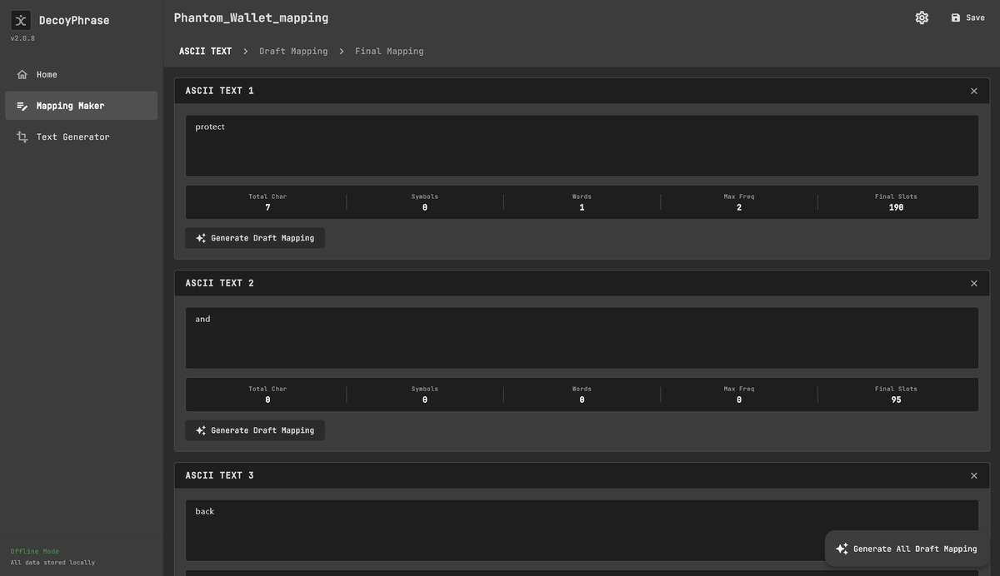

# Mapping Maker

<figure><figcaption></figcaption></figure>

## What Is the Mapping Maker

**Mapping Maker** functions as the core transformation engine within the Decoy Phrase Generator. This component takes the original sensitive data as input and produces two separate outputs that have no meaning or value when standing alone.

The primary roles of the Mapping Maker include:

* Generating [**decoy text**](https://docs.decoyphrase.com/~/changes/88/core-concepts/two-part-security-model/decoy-text) that appears normal and non-suspicious
* Generating a [**mapping file**](https://docs.decoyphrase.com/~/changes/88/core-concepts/two-part-security-model/mapping-file) that serves as a technical guide for recovering the original data through the Text Generator

## What it contains

**Mapping Maker** provides a set of components and information designed to help users create decoy text and mapping files accurately, consistently, and securely. Mapping Maker consists of three main sections, each section represents a distinct stage in the mapping lifecycle, ensuring accuracy, consistency, and recoverability.

### 1. ASCII Text

<figure><figcaption></figcaption></figure>

ASCII Text is the primary input field for entering the original seed phrase, password, or other sensitive data. This section displays statistical summaries of the sensitive data entered in the ASCII Text field, including:

<strong>Total Char</strong>

The total number of characters in the text, including:

* Uppercase letters (A–Z)
* Lowercase letters (a–z)
* Numbers
* Symbols
* Spaces

<strong>Symbols</strong>

The number of symbol characters in the text.

<strong>Words</strong>

The total number of words in the text.

<strong>Max Frequency</strong>

The maximum count of occurrences among all individual characters in the ASCII Text field.
\
This value is used as the basis for calculating the final mapping size.

<strong>Final Slots</strong>

The total number of slots in the final mapping, calculated using the formula:

**95 standard ASCII characters × Max Frequency**

This value determines the final size of the mapping file.


* All text is processed locally
* Nothing is stored after the process is completed
* Data is never sent to any server or third party


***

### 2. Draft Mapping

<figure><figcaption></figcaption></figure>

Draft Mapping is a temporary mapping provided to help users fill in decoy values more easily.

Its purposes include:

* Acting as a preparation stage before generating the [final mapping](https://docs.decoyphrase.com/~/changes/88/core-concepts/two-part-security-model/mapping-file)
* Preventing users from having to work directly with a very large table
* Serving as the primary interface during the decoy text creation process

It includes the following features:

**A. Bulk Edit Decoy Values**

> **Bulk Edit Decoy Values** is a fast input method that allows users to enter or modify multiple decoy values at once, without having to edit each entry individually in the Draft Mapping table.

**Function:**

* Enables batch input of decoy values.
* Reduces manual, one-by-one editing.
* Helps maintain consistency across large mappings.

**B. All Decoy Preview**

> **All Decoy Preview** provides a live view of how the complete decoy text will appear once generated.

**Function:**

* Displays the decoy output in **paragraph mode** or **line-by-line mode**.
* Serves as the point where the final decoy text is constructed.
* Allows users to directly download the generated decoy text.

***

### 3. Final Mapping

<figure><figcaption></figcaption></figure>

The [Final Mapping](https://docs.decoyphrase.com/~/changes/88/core-concepts/two-part-security-model/mapping-file) section is the last stage where all decoy values are completed and validated before the mapping is finalized and stored. The final mapping will contain all 95 standard ASCII characters, with each character repeated until it reaches the Max Frequency value derived from the ASCII Text, ensuring uniform decoy distribution and reducing predictable patterns.


**Key characteristics:**

* Serves as the primary reference for recovery in the Text Generator
* Must be used together with the decoy text
* Does not contain ASCII Text, Decoy Preview, or Draft Mapping.
* Has no meaning or value on its own
* Sequential pattern of the 95 standard ASCII characters, repeated until Max Frequency is reached.


It includes the following features:

**A. Bulk Edit Decoy Values**

> **Bulk Edit Decoy Values** is a fast input method used to fill empty decoy slots in the Final Mapping, especially when users choose to manually define specific decoy words that are not available through autofill.

**Function:**

* Allows batch input for remaining empty decoy entries.
* Helps users enforce uniform decoy values across sensitive characters.
* Reduces the risk of creating recognizable or predictable patterns in the final mapping.

**B. Auto Fill**

> **Auto Fill** is a method for automatically filling any remaining empty decoy slots in the Final Mapping.

**Function:**

* Completes unmapped decoy entries automatically.
* Ensures no empty slots remain before finalization.
* Provides a consistent and complete mapping structure.

Available modes include:

<strong>English Words</strong>

Uses approximately 460,000 English words

<strong>Random 1 Char</strong>

One random ASCII character

<strong>Random 2 Char</strong>

Two random ASCII characters

<strong>Random 3 Char</strong>

Three random ASCII characters

<strong>Random 4 Char</strong>

Four random ASCII characters


All Auto Fill modes are:

* Randomized
* Non-sequential
* Applied until all possible slots are filled


## Separation by Design

The Mapping Maker is built on a **separation by design** principle, enforcing security from the earliest stage.

This principle ensures that:

* Decoy text and the mapping file are always created as two separate artifacts
* No single file has standalone value or risk
* The Final Mapping contains only the finalized mapping structure


**The final mapping file** contains no ASCII text, no decoy text, and no draft mappings.


Recovery can only be performed intentionally by the user through the [**Text Generator**](text-generator.md)
