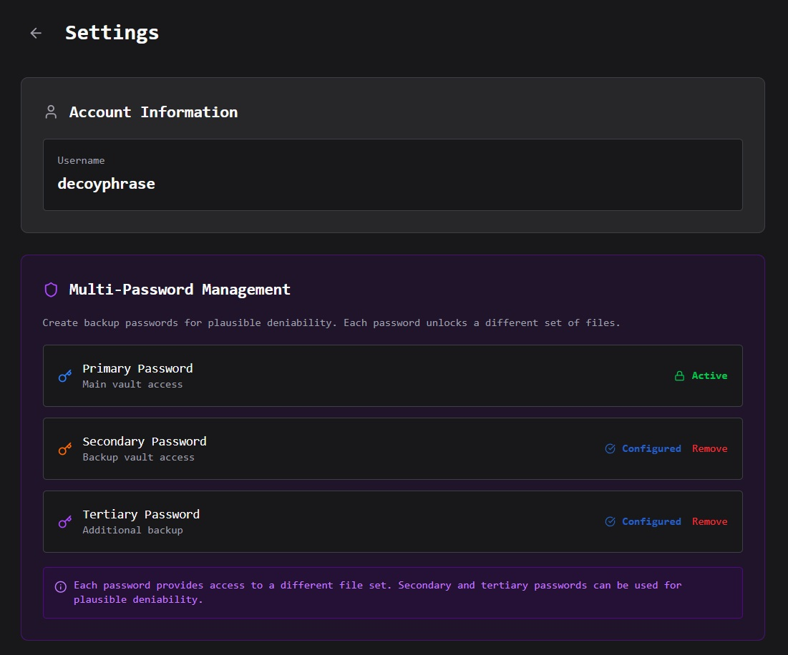

# Multi-Password Management

<figure><figcaption></figcaption></figure>

**Multi-Password Management** is a feature in **Decoy Phrase Permanent Storage** that allows users to have **2–3 separate vaults (storage spaces) within a single account**, each protected by a **different password**.

Users can create additional passwords during account registration or later through **Settings**, without the need to create multiple accounts.

## Primary Purpose

This feature is designed to **separate the storage of Decoy Text and Mapping Files**, even though both belong to the same user account.

In the Decoy Phrase system, **Decoy Text and Mapping Files must always be stored separately**, whether on local devices or in permanent storage.

This separation is a **critical preventive measure** to eliminate single points of failure.

## How It Works (High-Level)

* One account → can contain multiple vaults
* Each vault:
  * Has its **own password**
  * Is **logically isolated** from other vaults
  * Cannot be accessed without the corresponding password
* Users are free to assign usage:
  * Vault A → stores Decoy Text
  * Vault B → stores Mapping Files
  * (Optional) Vault C → additional archives or backups

Even within the same account, each vault **functions as an independent storage space**.

## Why This Matters

Decoy Phrase Permanent Storage uses a **Shared Master Wallet Model**, where a single system wallet is responsible for managing uploads to the blockchain in order to provide:

* A simpler user experience (no direct blockchain interaction)
* Low-cost or free usage for users
* Long-term storage management

Because of this model, the **primary security boundary resides on the user side**, not in the wallet or on a server.

Multi-Password Vaults ensure that:

* Access to one vault **does not automatically grant access to others**
* Compromise of a single password **does not expose the entire data structure**
* Decoy Text and Mapping Files are **never stored within the same access scope**

## Storage Capacity

Each **account or vault** created in **Decoy Phrase Permanent Storage** is assigned a **fixed storage capacity** designed to support long-term, secure text archiving.

#### Capacity Limits per Vault

* **Maximum number of files:** 500 files
* **Maximum file size:** 5 MB per file

These limits apply **independently to each vault**.


When using **Multi-Password Vaults**, each vault receives its **own independent capacity allocation**. This means users can store up to **500 files per vault**, fully isolated by separate passwords. By utilizing the maximum of **three vaults**, users can store up to **1,500 files in total**, while maintaining strict separation between Decoy Text, Mapping Files, and optional additional archives.

