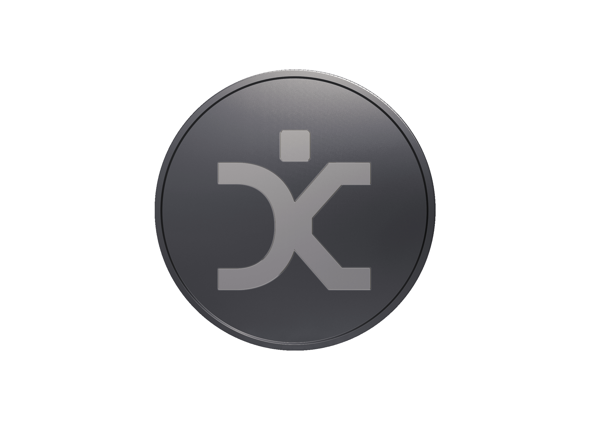

# About $DECOY

<figure><figcaption></figcaption></figure>

$DECOY is a 100% community-driven crypto token built on the Solana network and launched through the [**Bags.fm**](https://bags.fm)  launchpad.

As a non-profit-oriented token, $DECOY is not designed to generate commercial profit. Instead, the standard 1% creator fee from trading volume is automatically distributed according to the protocol mechanism — with 60% allocated to the team fund wallet and 40% directed toward automatic liquidity compounding.

```
CA : Soon
```

## Background

Decoy Phrase was created as a **community initiative** to support the development of **digital key security technologies**, including seed phrases, passwords, private keys, recovery codes, and similar sensitive data.

The project leverages the Web3 crowdfunding model provided by [Bags.fm](https://bags.fm), enabling anyone to launch a token without programming knowledge. As a fully community-driven token, major decisions—such as feature development and fund allocation—are made transparently and openly by the community.

## Tokenomics

The $DECOY token has a **fixed total supply of 999.01 million tokens**. The entire supply is fully circulating, with **no reserved or locked tokens**.

$DECOY's tokenomics follow the standard [Bags.fm](https://bags.fm) launchpad mechanism:

* **Total Supply:** 999.01 million tokens
* **Circulating Supply:** 939.96 million tokens (94% of total supply), representing full public distribution at launch with no private sale
* **Token Model:** No inflation and no additional token issuance after launch.&#x20;
* **Initial Allocation:**  At launch, DecoyPhrase acquired 6% of the total token supply via early allocation.


The initial allocation tokens will never be sold and are designed to prevent early sniper activity, giving holders confidence and security.


## Fee Mechanism

With [Bags.fm](https://bags.fm/apps) integration features, $DECOY follows the standard creator fee: 1% of all trading volume is collected and distributed as follows:

* **40% – Compound Liquidity**\
  Automatically compounds liquidity for the token. Higher liquidity enables larger trades and supports higher trading volume.
* **60% – Team Fund Wallet**\
  Allocated to support long-term development, operations, and ecosystem growth.

```
2rfkLCdAdZ2Z49BW6XiwSpkr6sLg2axXWQLKxG6asqZp
```

With this distribution, Decoy Phrase aims to create a balanced ecosystem that supports traders, long term holders, and ensures the long-term sustainability of the project.


Donations collected through creator fees are allocated to support the sustainability of the Decoy ecosystem. This includes technical development, infrastructure, community initiatives, and reasonable compensation or operational support for contributors and team members actively maintaining and building the project. [Learn more about donations here.](about-donations.md)


## Community Structure

Decoy adopts a **community-based governance model**. Token holders are encouraged to actively participate in discussions and decision-making through open communication channels such as forums or community groups.

There is no centralized controlling entity. Instead, [Bags.fm](https://bags.fm) promotes organic community growth: the stronger and larger the community, the greater the shared benefit for all participants. Any Decoy token holder may propose ideas, initiatives, or development directions, which are discussed collectively.

While there is no formal on-chain voting mechanism, Decoy upholds strong principles of decentralization, collaboration, and accountability. All proposals and fund usage discussions are communicated openly, and blockchain transparency ensures that token supply and creator fee allocations remain publicly auditable.

## Conclusion

$DECOY token represents a **non-profit, community-driven initiative** built on the Solana ecosystem and launched via [Bags.fm](https://bags.fm) to support the development of **Decoy Phrase** and digital key security technologies.

With a fixed supply of 999.01 million tokens, a fair distribution model, and a fully transparent 1% creator-fee system, DecoyPhrase combines community incentives with social impact. The project’s success depends entirely on community participation—the more support, the stronger the ecosystem.

Decoy stands as a non-profit initiative with a shared vision: **To build a non-profit movement that empowers individuals to secure and safeguard their sensitive data and digital keys — adapting to the evolving digital world and restoring full control to each individual.**


## Disclaimer

This document is provided solely for informational and educational purposes. The $DECOY token is not financial advice and not an investment instrument with guaranteed returns.

There is no guarantee of value, liquidity, or future profit. The value of the token may increase, decrease, or become worthless.

Decoy is a community-driven, non-profit initiative. By purchasing or participating, each individual is deemed to have understood the risks, agreed to them, and assumes full responsibility for all actions and decisions taken.

